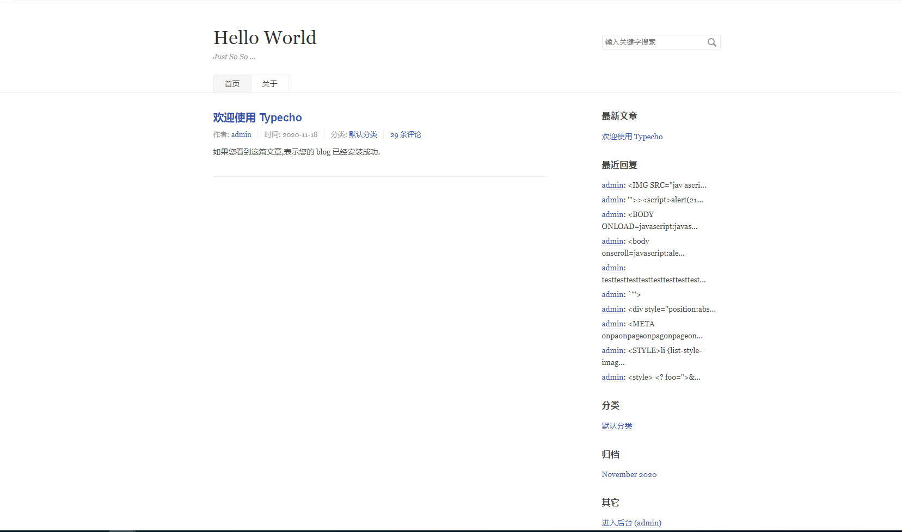
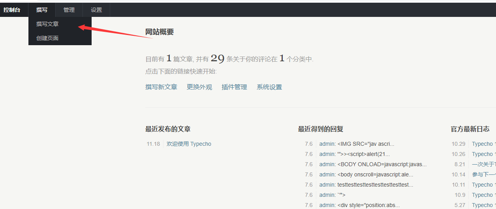
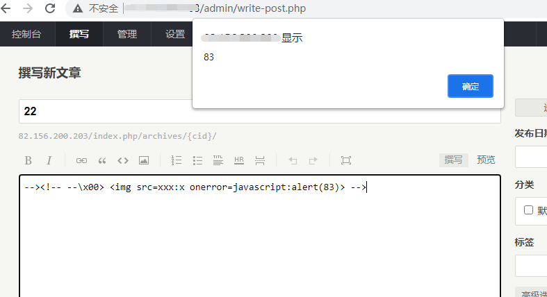
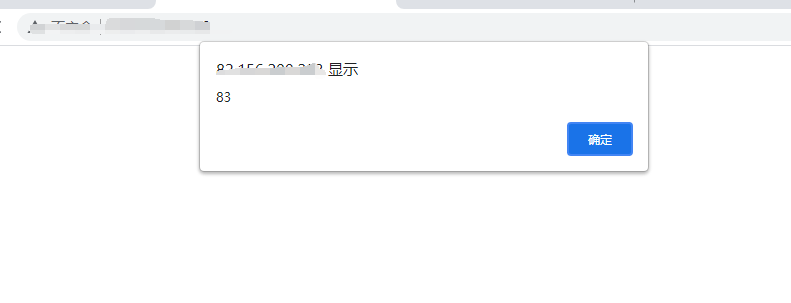
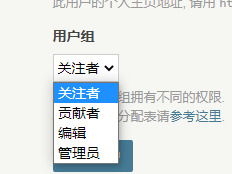
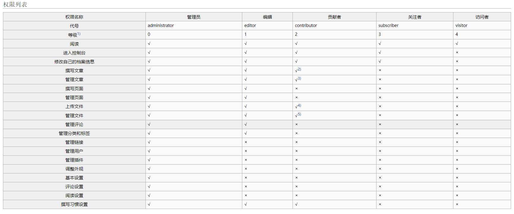

# A storage XSS vulnerability in the background of Tyecho CMS 
## Vulnerability details
**Name of vulnerability：** A storage XSS vulnerability in the background of Tyecho CMS  
**Discoverer：**GRLpiz  
**Email:**heh6@qq.com  
**Program:**Typecho 
**Version:** 1.1 (17.10.30)  
**Particulars:**There is an XSS injection vulnerability in the background rich text editor of TypeEcho system, which allows malicious JS statements to be inserted into articles published by low-privilege accounts to obtain sensitive information such as cookies from high-privilege accounts.

## Vulnerability discovery process



1、Log in to the typecho background 

`http://domain/admin`  

In the login state, enter the post section




2、Paste the following code in the body to test

```--><!-- --\x00>  -->```


You can find that you can execute a JS statement at the post to save the content of the post for further testing




3、When you visit the TypeEcho system home page directly to view articles

You can see that the system is running malicious JS statements




```
<div class="post-content" itemprop="articleBody">
            <p>--&gt;&lt;!-- --x00&gt;  --&gt;</p>        </div>
```

In filtering, only the statement ```--><!-- --\X00> ```parameter is invalidated by```””``` 
JS statements in the middle still execute normally

So just add obfuscating JS statements before and after the actual JS statement to get around it


## Loophole harm
Low-privilege users can publish articles with malicious JS code through this vulnerability to attract high-privilege users to visit, thereby stealing sensitive information such as cookies, so as to achieve privilege promotion, malicious program execution and other operations.





