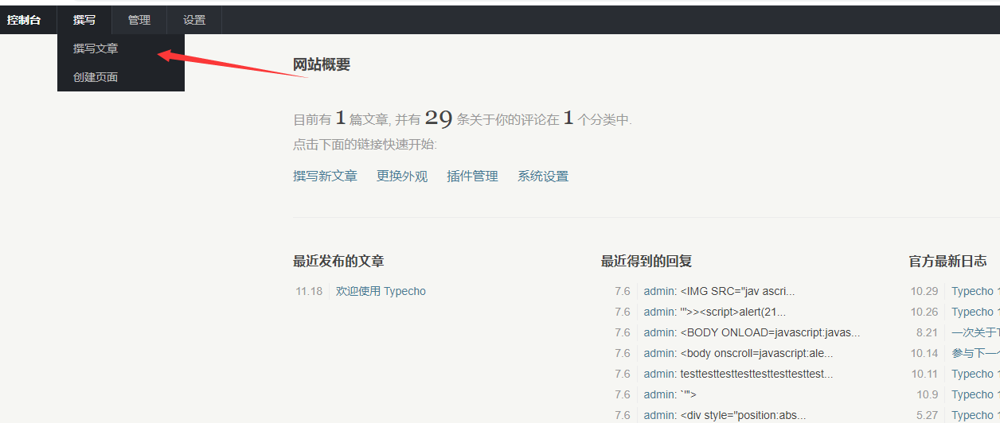
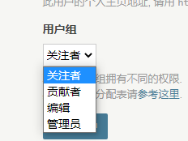
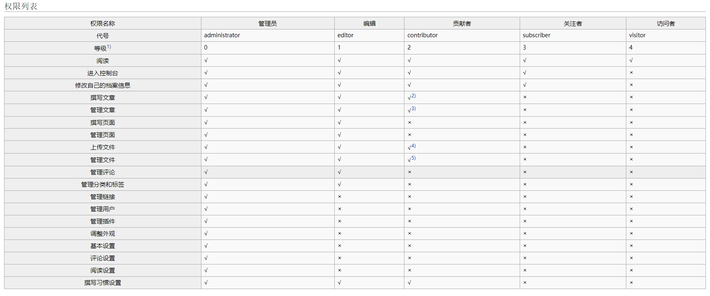

# Typecho CMS 系统后台存在储存型XSS漏洞
## 漏洞信息
漏洞名称：Typecho CMS系统后台存在储存性XSS漏洞  
漏洞申报人：GRLpiz  
邮箱：heh6@qq.com  
程序：Typecho  
版本范围： 1.1 (17.10.30)  
漏洞说明：typecho系统后台富文本编辑器存在xss注入漏洞，可通过低权限账号发布文章中插入恶意js语句，获取高权限账户cookie等敏感信息。  

## 漏洞复现过程


1、登录到typecho 后台 `http://domain/admin`  
在登录状态 进入 撰写文章处   



2、正文处 粘贴以下一串代码 进行测试操作  

```--><!-- --\x00>  -->```

可发现在转写文章处即可执行js语句 将文章内容保存 进行下一步测试  


3、直接访问typecho系统主页 查看文章时  

可以发现，系统运行着恶意js语句  


4、查看前端页面代码

```
<div class="post-content" itemprop="articleBody">
            <p>--&gt;&lt;!-- --x00&gt;  --&gt;</p>        </div>
```

在过滤中 仅仅将语句中 ```--><!-- --\X00> ```参数通过```””``` 使其失效
在其中间的js语句仍可正常执行


所以仅需要在真实要执行的js语句前后加上混淆用js语句 即可绕过

## 造成危害
低权限用户可通过此漏洞发布有恶意js代码的文章，吸引高权限用户进行访问，从而盗取cookie等敏感信息，从而实现权限提升、执行恶意程序等操作。





